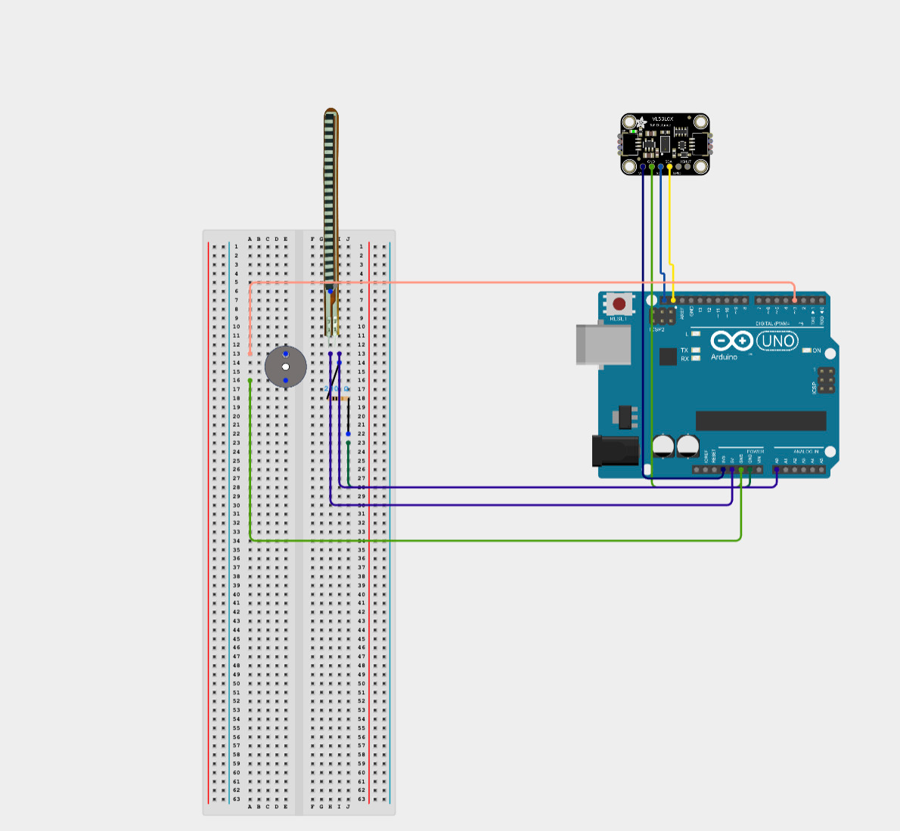
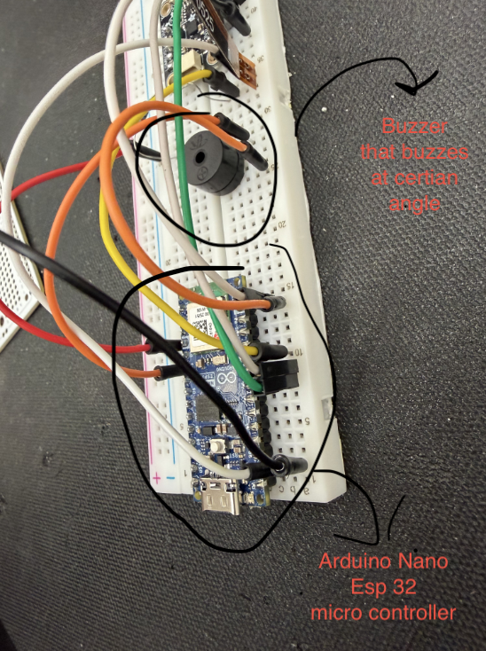
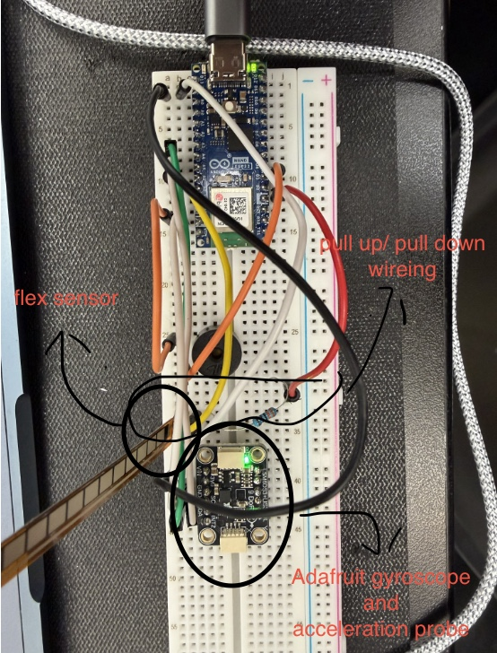

# Knee Rehabilitation Device
Ever been hurt your knee in your respective sport? look no further than this knee rehabilitation device. This device brings comfort to your injury and helps you recover faster. Heres how you can make your own!
You should comment out all portions of your portfolio that you have not completed yet, as well as any instructions :


| **Engineer** | **School** | **Area of Interest** | **Grade** |
|:--:|:--:|:--:|:--:|
| Peter L | Basis Independent Silicon Valley | Mechanical Engineering | Incoming Sophmor

**Replace the BlueStamp logo below with an image of yourself and your completed project. Follow the guide [here](https://tomcam.github.io/least-github-pages/adding-images-github-pages-site.html) if you need help.**


  
# Final Milestone

**Don't forget to replace the text below with the embedding for your milestone video. Go to Youtube, click Share -> Embed, and copy and paste the code to replace what's below.**

<iframe width="560" height="315" src="https://www.youtube.com/embed/F7M7imOVGug" title="YouTube video player" frameborder="0" allow="accelerometer; autoplay; clipboard-write; encrypted-media; gyroscope; picture-in-picture; web-share" allowfullscreen></iframe>

For your final milestone, explain the outcome of your project. Key details to include are:
- What you've accomplished since your previous milestone
- What your biggest challenges and triumphs were at BSE
- A summary of key topics you learned about
- What you hope to learn in the future after everything you've learned at BSE


# Second Milestone

**Don't forget to replace the text below with the embedding for your milestone video. Go to Youtube, click Share -> Embed, and copy and paste the code to replace what's below.**

<iframe width="560" height="315" src="https://www.youtube.com/embed/y3VAmNlER5Y" title="YouTube video player" frameborder="0" allow="accelerometer; autoplay; clipboard-write; encrypted-media; gyroscope; picture-in-picture; web-share" allowfullscreen></iframe>

For your second milestone, explain what you've worked on since your previous milestone. You can highlight:
- Technical details of what you've accomplished and how they contribute to the final goal
- What has been surprising about the project so far
- Previous challenges you faced that you overcame
- What needs to be completed before your final milestone 

# First Milestone


<iframe width="560" height="315" src="https://www.youtube.com/embed/yY_B-YwpOjE?si=oFKLVSZUXxvjqIM-" title="YouTube video player" frameborder="0" allow="accelerometer; autoplay; clipboard-write; encrypted-media; gyroscope; picture-in-picture; web-share" referrerpolicy="strict-origin-when-cross-origin" allowfullscreen></iframe>


The flex sensor connects to pin A6 on the Arduino and works by changing its electrical resistance when it bends. The code reads this as a number between 0 and 1023 using analogRead(), which represents how much voltage is coming through the sensor at that moment. Since that raw number doesn't mean anything by itself, the code uses map() to convert it into a real angle, from 0 to 130 degrees, based on two reference points: what the sensor reads when totally flat, and what it reads when bent all the way. Those two reference numbers had to be found by testing the sensor and writing down what it actually showed on the screen, since every sensor reads slightly differently. One extra line, constrain(), makes sure the angle never goes above 130 or below 0, even if the sensor gives a slightly weird reading.
The buzzer is connected to pin 3 and uses a function called tone() instead of just turning it on and off, because a piezo buzzer needs a vibrating signal to actually make sound, not just a steady flow of power. In the code, there's a constant called triggerAngle set to 85 degrees, and every time the program runs, it checks if the current knee angle is at or above that number. If it is, the buzzer turns on; if not, it stays off. This check happens constantly, over and over, so the buzzer can react instantly as soon as the angle crosses that 85-degree mark, even while other parts of the code are running. On a prototype bread board, I connected the male to male wires to my arduino nano esp 32 and the flex sensor with the analog 6, ground and the 3.3 V wire. This was kind of troubling with me not being able to figure out the right configuration with multiple attemps giving numbers that were random. Finally I was able to figure it out by using a pull up configuration with the wires and resistors. I also had a very simple configuration with a D3 port and a ground port for a buzzer on the bread board. 
The gyroscope and accelerometer are both built into one sensor board, and the code talks to them using a connection called I2C, which only needs two wires (SDA and SCL) even though there are two separate sensor chips. The gyroscope measures how fast something is spinning, and the code converts its raw numbers into degrees per second so they're easier to understand. The accelerometer measures movement in three directions at once (X, Y, and Z), and the code combines all three into one single number using some math (basically the Pythagorean theorem in 3D). Since gravity is always pulling down even when nothing is moving, the code also subtracts that constant gravity number out, so what's left over actually represents real movement instead of just gravity sitting there. This was the most simple configuration with Vim going into the 3.3V port, the GND going into the ground port, the SCL going into the a5 port, and the SDA going into the a4 port. There was no issues with this set up.


# Schematics 

# Pictures





# Code

```c++
#include <Adafruit_LSM6DS3TRC.h>
#include <Adafruit_LIS3MDL.h>
#include <Adafruit_Sensor.h>

const int flexPin0 = A6;
const int buzzerPin = 3;

int rawValue;
int angle;

const int flatValue = 520;
const int bentValue = 950;      
const int triggerAngle = 65;
const int buzzFrequency = 1000;
const int maxAngle = 130;

// --- IMU objects ---
Adafruit_LSM6DS3TRC lsm6ds;
Adafruit_LIS3MDL lis3mdl;

const unsigned long recordDuration = 5000;    
const unsigned long flexRecordDuration = 10000; 
const int sampleDelay = 50;

const float GRAVITY = 9.81; 


const float baseline_angleMin = 0.0;
const float baseline_angleMax = 130.0;


const float baseline_velocity_walking_low = 95.0;
const float baseline_velocity_walking_high = 100.0;
const float baseline_velocity_loading = 200.0;
const float baseline_velocity_stance = 100.0;
const float baseline_velocity_swing_low = 350.0;
const float baseline_velocity_swing_high = 400.0;


const float baseline_linAccel_swing_low = 10.0;
const float baseline_linAccel_swing_high = 15.0;
const float baseline_linAccel_impact_low = 26.0;
const float baseline_linAccel_impact_high = 36.0;


enum Phase { WALKING, LOADING, STANCE, SWING, IMPACT };
Phase currentPhase = WALKING;

void setup() {
  Serial.begin(115200);
  while (!Serial) delay(10);

  pinMode(buzzerPin, OUTPUT);

  if (!lsm6ds.begin_I2C()) {
    Serial.println("Failed to find LSM6DS3TR-C chip");
  }
  if (!lis3mdl.begin_I2C()) {
    Serial.println("Failed to find LIS3MDL chip");
  }

  Serial.println("Setup complete.");
  printMenu();
}

void printMenu() {
  Serial.println("\nCommands:");
  Serial.println("  go         - gyro/accel recording (5s)");
  Serial.println("  go2        - flex sensor angle recording (10s)");
  Serial.println("  phase walking / loading / stance / swing / impact");
  Serial.println("         - sets which baseline to compare against before your next 'go'");
}

void loop() {
  rawValue = analogRead(flexPin0);
  angle = map(rawValue, flatValue, bentValue, 0, maxAngle);
  angle = constrain(angle, 0, maxAngle);

  if (angle >= triggerAngle) {
    tone(buzzerPin, buzzFrequency);
  } else {
    noTone(buzzerPin);
  }

  if (Serial.available() > 0) {
    String command = Serial.readStringUntil('\n');
    command.trim();

    if (command.equalsIgnoreCase("go")) {
      recordSession();
    } else if (command.equalsIgnoreCase("go2")) {
      recordFlexSession();
    } else if (command.startsWith("phase ")) {
      setPhase(command.substring(6));
    }
  }

  delay(100);
}

void setPhase(String phaseName) {
  phaseName.trim();
  if (phaseName.equalsIgnoreCase("walking")) {
    currentPhase = WALKING;
    Serial.println("Phase set to: WALKING");
  } else if (phaseName.equalsIgnoreCase("loading")) {
    currentPhase = LOADING;
    Serial.println("Phase set to: LOADING");
  } else if (phaseName.equalsIgnoreCase("stance")) {
    currentPhase = STANCE;
    Serial.println("Phase set to: STANCE");
  } else if (phaseName.equalsIgnoreCase("swing")) {
    currentPhase = SWING;
    Serial.println("Phase set to: SWING");
  } else if (phaseName.equalsIgnoreCase("impact")) {
    currentPhase = IMPACT;
    Serial.println("Phase set to: IMPACT");
  } else {
    Serial.println("Unknown phase. Use: walking, loading, stance, swing, impact");
  }
}

float getLinearAccelMag(sensors_event_t &accel) {
  float magWithGravity = sqrt(sq(accel.acceleration.x) + sq(accel.acceleration.y) + sq(accel.acceleration.z));
  float movementOnly = magWithGravity - GRAVITY;
  return abs(movementOnly);
}

void recordSession() {
  Serial.print("Gyro/Accel recording started... Phase: ");
  printPhaseName();

  sensors_event_t accel, gyro, temp, mag;

  lsm6ds.getEvent(&accel, &gyro, &temp);
  float gyroZ_initial_dps = gyro.gyro.z * 57.2958; 
  float accelMag_initial = getLinearAccelMag(accel);

  float velocity_sum = 0;
  float accelMag_sum = 0;
  float accelMag_max = 0;
  int sampleCount = 0;

  float velocity_final_dps = gyroZ_initial_dps;
  float accelMag_final = accelMag_initial;

  unsigned long startTime = millis();

  while (millis() - startTime < recordDuration) {
    rawValue = analogRead(flexPin0);
    angle = map(rawValue, flatValue, bentValue, 0, maxAngle);
    angle = constrain(angle, 0, maxAngle);

    if (angle >= triggerAngle) {
      tone(buzzerPin, buzzFrequency);
    } else {
      noTone(buzzerPin);
    }

    lsm6ds.getEvent(&accel, &gyro, &temp);

    float currentVelocity_dps = gyro.gyro.z * 57.2958;
    float currentAccelMag = getLinearAccelMag(accel);

    Serial.print("Velocity: ");
    Serial.print(currentVelocity_dps);
    Serial.print(" deg/s   Accel: ");
    Serial.print(currentAccelMag);
    Serial.println(" m/s^2");

    velocity_sum += abs(currentVelocity_dps);
    accelMag_sum += currentAccelMag;
    if (currentAccelMag > accelMag_max) accelMag_max = currentAccelMag;

    velocity_final_dps = currentVelocity_dps;
    accelMag_final = currentAccelMag;

    sampleCount++;
    delay(sampleDelay);
  }

  float velocity_avg_dps = velocity_sum / sampleCount;
  float accelMag_avg = accelMag_sum / sampleCount;

  Serial.println("--- Gyro/Accel recording complete ---");
  Serial.print("Samples collected: "); Serial.println(sampleCount);

  Serial.println("\nAngular velocity (deg/s, |Z axis|):");
  Serial.print("  Initial: "); Serial.println(abs(gyroZ_initial_dps));
  Serial.print("  Final:   "); Serial.println(abs(velocity_final_dps));
  Serial.print("  Average: "); Serial.println(velocity_avg_dps);

  Serial.println("\nLinear acceleration magnitude, movement-only (m/s^2):");
  Serial.print("  Initial: "); Serial.println(accelMag_initial);
  Serial.print("  Final:   "); Serial.println(accelMag_final);
  Serial.print("  Average: "); Serial.println(accelMag_avg);
  Serial.print("  Peak:    "); Serial.println(accelMag_max);

  compareVelocityToBaseline(velocity_avg_dps);
  compareLinAccelToBaseline(accelMag_avg, accelMag_max);

  Serial.println("\nType 'go' or 'go2' to record again.");
}
void recordFlexSession() {
  Serial.println("Flex sensor recording started...");

  long angleSum = 0;
  int sampleCount = 0;
  int angle_initial = 0;
  int angle_final = 0;
  int angle_max = 0;

  unsigned long startTime = millis();

  while (millis() - startTime < flexRecordDuration) {
    rawValue = analogRead(flexPin0);
    angle = map(rawValue, flatValue, bentValue, 0, maxAngle);
    angle = constrain(angle, 0, maxAngle);

    if (angle >= triggerAngle) {
      tone(buzzerPin, buzzFrequency);
    } else {
      noTone(buzzerPin);
    }

    Serial.print("Raw: ");
    Serial.print(rawValue);
    Serial.print("  Angle: ");
    Serial.println(angle);

    if (sampleCount == 0) {
      angle_initial = angle;
    }
    angle_final = angle;
    if (angle > angle_max) angle_max = angle;

    angleSum += angle;
    sampleCount++;

    delay(sampleDelay);
  }

  float angle_avg = (float)angleSum / sampleCount;

  Serial.println("--- Flex sensor recording complete ---");
  Serial.print("Samples collected: "); Serial.println(sampleCount);
  Serial.print("Initial angle: "); Serial.println(angle_initial);
  Serial.print("Final angle: "); Serial.println(angle_final);
  Serial.print("Average angle: "); Serial.println(angle_avg);
  Serial.print("Peak angle this session: "); Serial.println(angle_max);

  compareAngleToBaseline(angle_max);

  Serial.println("\nType 'go' or 'go2' to record again.");
}


void printPhaseName() {
  switch (currentPhase) {
    case WALKING: Serial.println("WALKING"); break;
    case LOADING: Serial.println("LOADING"); break;
    case STANCE: Serial.println("STANCE"); break;
    case SWING: Serial.println("SWING"); break;
    case IMPACT: Serial.println("IMPACT"); break;
  }
}

void compareVelocityToBaseline(float measured_dps) {
  float low = 0, high = 0;
  String label = "";

  switch (currentPhase) {
    case WALKING:
      low = baseline_velocity_walking_low; high = baseline_velocity_walking_high; label = "walking baseline";
      break;
    case LOADING:
      low = baseline_velocity_loading; high = baseline_velocity_loading; label = "loading phase baseline";
      break;
    case STANCE:
      low = baseline_velocity_stance; high = baseline_velocity_stance; label = "stance phase baseline";
      break;
    case SWING:
      low = baseline_velocity_swing_low; high = baseline_velocity_swing_high; label = "swing phase baseline";
      break;
    default:
      Serial.println("\n(No angular velocity baseline set for this phase)");
      return;
  }

  Serial.print("\nComparing avg velocity to "); Serial.print(label);
  Serial.print(" ("); Serial.print(low); Serial.print("-"); Serial.print(high); Serial.println(" deg/s):");

  if (measured_dps < low) {
    Serial.print("  Below baseline range by "); Serial.print(low - measured_dps); Serial.println(" deg/s");
  } else if (measured_dps > high) {
    Serial.print("  Above baseline range by "); Serial.print(measured_dps - high); Serial.println(" deg/s");
  } else {
    Serial.println("  Within baseline range");
  }
}

void compareLinAccelToBaseline(float avgAccel, float peakAccel) {
  float low = 0, high = 0;
  String label = "";

  switch (currentPhase) {
    case SWING:
      low = baseline_linAccel_swing_low; high = baseline_linAccel_swing_high; label = "swing-phase linear accel baseline";
      break;
    case IMPACT:
      low = baseline_linAccel_impact_low; high = baseline_linAccel_impact_high; label = "impact-strike linear accel baseline";
      break;
    default:
      Serial.println("(No linear acceleration baseline set for this phase - use 'phase swing' or 'phase impact')");
      return;
  }

  Serial.print("Comparing peak linear accel to "); Serial.print(label);
  Serial.print(" ("); Serial.print(low); Serial.print("-"); Serial.print(high); Serial.println(" m/s^2):");

  if (peakAccel < low) {
    Serial.print("  Below baseline range by "); Serial.print(low - peakAccel); Serial.println(" m/s^2");
  } else if (peakAccel > high) {
    Serial.print("  Above baseline range by "); Serial.print(peakAccel - high); Serial.println(" m/s^2");
  } else {
    Serial.println("  Within baseline range");
  }
}

void compareAngleToBaseline(int measuredAngle) {
  Serial.print("\nComparing to healthy ROM baseline (");
  Serial.print(baseline_angleMin); Serial.print("-"); Serial.print(baseline_angleMax);
  Serial.println(" deg):");

  if (measuredAngle < baseline_angleMin) {
    Serial.println("  Below healthy range");
  } else if (measuredAngle > baseline_angleMax) {
    Serial.println("  Above healthy range");
  } else {
    Serial.print("  Within healthy range, reaching ");
    Serial.print((measuredAngle / baseline_angleMax) * 100);
    Serial.println("% of max healthy ROM");
  }
}
```

# Bill of Materials

| **Part** | **Note** | **Price** | **Link** |
|:--:|:--:|:--:|:--:|
| Arduinio Nano Esp32 | The micro controller that connects gyroscope, accelarometer, and flex sensor | $14.64 | <a href="https://www.amazon.com/Arduino-A000066-ARDUINO-UNO-R3/dp/B008GRTSV6/](https://store-usa.arduino.cc/products/nano-esp32)"> Link </a> |
| Adafruit LSM6DS3TR-C+LIS3MDL Accelerometer | tracks the angular velocity along with the acceration from the x,y, and z axis | $3.33 | <a href="https://www.amazon.com/Arduino-A000066-ARDUINO-UNO-R3/dp/B008GRTSV6/](https://www.adafruit.com/product/5543?gad_source=1&gclid=Cj0KCQjwhb60BhClARIsABGGtw8-jY7wSMWS0FXfzOjqk8mHnPteYpW1C7iLXs6zfJK6qxsxANZ_MVoaAqhWEALw_wcB)"> Link </a> |
| Flex Sensor(4.5”) | measures the degree of the angle the knee is bending| $17.95 | <a href="https://www.amazon.com/Arduino-A000066-ARDUINO-UNO-R3/dp/B008GRTSV6/](https://www.sparkfun.com/flex-sensor-4-5.html)"> Link </a> |
| Knee Compression Sleeve | Holds components in place and attached to the knee | $7.99 | <a href="https://www.amazon.com/Arduino-A000066-ARDUINO-UNO-R3/dp/B008GRTSV6/](https://www.amazon.com/Compression-Sleeve-Support-Running-Medium/dp/B0987XN6QH/ref=sr_1_1_sspa?crid=1YPAWDY72UPC4&keywords=knee%2Bsleeve&qid=1685066084&sprefix=knee%2Bsleev%2Caps%2C182&sr=8-1-spons&spLa=ZW5jcnlwdGVkUXVhbGlmaWVyPUEzRjkzWEExWDZSMEEwJmVuY3J5cHRlZElkPUEwMDE2MDE5NjNVMTlUWTBNNUkzJmVuY3J5cHRlZEFkSWQ9QTAwNjE5MDYzTDhJTE1IWFZaRUNVJndpZGdldE5hbWU9c3BfYXRmJmFjdGlvbj1jbGlja1JlZGlyZWN0JmRvTm90TG9nQ2xpY2s9dHJ1ZQ&th=1)"> Link </a> |
| 5000 mAh Power Bank (10cm x 3 cm) | powers everything | $17.99 | <a href="https://www.amazon.com/Arduino-A000066-ARDUINO-UNO-R3/dp/B008GRTSV6/](https://www.amazon.com/Anker-PowerCore-Ultra-Compact-High-Speed-Technology/dp/B01CU1EC6Y/ref=asc_df_B01CU1EC6Y/?tag=hyprod-20&linkCode=df0&hvadid=312111908612&hvpos=&hvnetw=g&hvrand=17851029625711693156&hvpone=&hvptwo=&hvqmt=&hvdev=c&hvdvcmdl=&hvlocint=&hvlocphy=9061320&hvtargid=pla-523807968135&th=1)"> Link </a> |
| Sewing Kit | sews everything together | $6.99 | <a href="https://www.amazon.com/Arduino-A000066-ARDUINO-UNO-R3/dp/B008GRTSV6/](https://www.amazon.com/Coquimbo-Traveler-Beginner-Emergency-Organizer/dp/B01G3LOLD6/ref=sr_1_7?crid=27CESEBIVTX3Z&keywords=sewing%2Bkit&qid=1689572065&sprefix=sewing%2Bk%2Caps%2C192&sr=8-7&th=1)"> Link </a> |
| 30AWG Tinned Copper Silicone Hook Up Wire | connects everything via soldering | $12.99 | <a href="https://www.amazon.com/Arduino-A000066-ARDUINO-UNO-R3/dp/B008GRTSV6/](https://www.amazon.com/StrivedayTM-Flexible-Silicone-electronic-electrics/dp/B01KQ2JNLI?th=1)"> Link </a> |
| USB Cable for Arduino | connects arduino to power source | $7.00 | <a href="https://www.amazon.com/Arduino-A000066-ARDUINO-UNO-R3/dp/B008GRTSV6/](https://www.amazon.com/USB-2-0-Cable-Type-M000006/dp/B013EOQUAW/ref=sr_1_4?keywords=Arduino+uno+cable&qid=1689572328&sr=8-4)"> Link </a> |
| PCB Board | allows wiring to be connected to arduino | $3.43 | <a href="https://www.amazon.com/Arduino-A000066-ARDUINO-UNO-R3/dp/B008GRTSV6/](https://www.amazon.com/ELEGOO-Prototype-Soldering-Compatible-Arduino/dp/B072Z7Y19F/ref=sr_1_12_sspa?crid=3OPU9MWHCVIKU&keywords=perf+board&qid=1689572424&sprefix=perf+boar%2Caps%2C174&sr=8-12-spons&sp_csd=d2lkZ2V0TmFtZT1zcF9tdGY&psc=1)"> Link </a> |
| Piezzo Buzzer | Buzzes when form is bad | $1.33 | <a href="https://www.amazon.com/Arduino-A000066-ARDUINO-UNO-R3/dp/B008GRTSV6/](https://www.amazon.com/Stemedu-SFM-20B-Electric-DC3-24V-Continuous/dp/B0BFHBXKND/ref=sr_1_4?crid=61ZO1XM97XPB&keywords=piezo+buzzer&qid=1689572505&sprefix=piezo+buz%2Caps%2C236&sr=8-4)"> Link </a> |


Circuit set ups for each componenet
If you dont understand how to hoop everything together via wiring or soldering on a bread board or pcb board use these links for circuit diagrams.
- [peizo buzzer setup](https://learn.sparkfun.com/tutorials/sik-experiment-guide-for-arduino---v33/experiment-11-using-a-piezo-buzzer)
- [Flex sensor explaination with circuit setup](https://learn.sparkfun.com/tutorials/flex-sensor-hookup-guide/all)
- [Adafruit LSM6DS3TR-C + LIS3MDL set up with other adafruit but can be convereted to arduino](https://learn.adafruit.com/adafruit-lsm6ds3tr-c-lis3mdl-precision-9-dof-imu/arduino)

